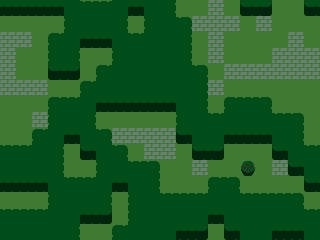

# LOVE-WFC

An implementation of the Wave Function Collapse (WFC) algorithm

## How to run

If you're on Windows, `./run.bat` should start the software. Otherwise please follow the instructions on the [LOVE wiki](https://love2d.org/wiki/Getting_Started#Running_Games).

WFC generation can be re-run by pressing `space`, and you can take screenshots with `s`.

The weights file generator script uses Node.js to read and process files. You can edit it to point at CSV files exported from [Tiled](https://www.mapeditor.org/), and run it using `node generate-weights`.

## How it works

[Wave Function Collapse](https://github.com/mxgmn/WaveFunctionCollapse) is an algorithm that uses weighted probability of adjacent tiles and a "wave" propagation mechanism to procedurally lay out a grid of tiles. WFC tiles have adjacency rules and overall frequency values, so that the algorithm knows how likely a tile on a grid is to "collapse" to a particular state. By extracting adjacency rules and frequency values from hand-made tile maps, we can use WFC to generate procedural tile grids that closely resemble the source material. This is particularly useful for videogame maps.

To write my own implementation of WFC for LOVE, I worked through the tutorial found at [Grid Bugs](https://www.gridbugs.org/wave-function-collapse) and made a few modifications where I ran into trouble. This is the best tutorial I've been able to find on WFC, as most authors seem to gloss over things or just do a rote copy of Maxim Gumin's original code. There are some bugs in the tutorial's description of propagation so I've commented mine a bit more.

## What's included

`main.lua` has commented-out code for experimenting with 2 different tilesets - 'simple' and 'garden' (the default). There's also an area that demonstrates pre-setting tiles in the grid before WFC is run - this could be useful if you knew you wante a structure on a mpa, but wanted to procedurally generate the surrounding area.

`generate-weights.js` is a Node.js script for reading map CSVs exported from Tiled and turning them into weights files. I've included my sample Tiled maps in `assets/maps` for convenience. It's important to note that the weights generator and WFC implementation assume a wrapping map, so probabilities for tiles are tabulated around the X and Y edges.

## Dependencies

LOVE-WFC uses and includes the [classic](https://github.com/rxi/classic) library by rxi for class-based organization of Lua code.
